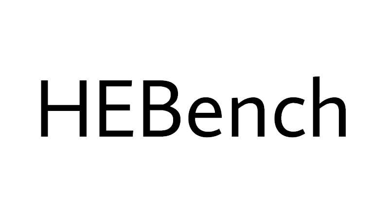
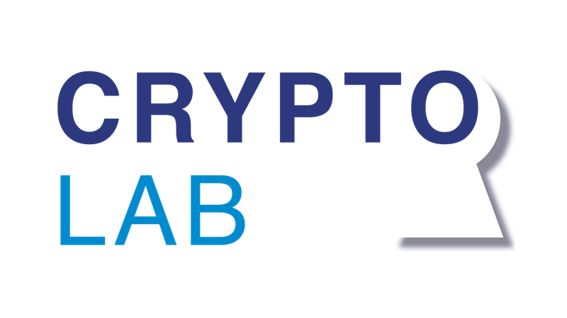

# HEBench Home

- HEBench Home
  - [The HEBench Organization](#the-hebench-organization)
  - [Founding Members](#founding-members)
- [About HEBench](about_hebench.md)
- [Available Backends](hebench_published_backends.md)
- [Getting Started](quickstart_guide.md)
- [Governance](governance.md)
- [Code of Conduct](conduct.md)

## The HEBench Organization
Homomorphic Encryption (HE) is considered by some to be the holy grail of cryptography. It enables computation on encrypted data without the need to ever decrypt it throughout its entire lifecycle. HE is currently undergoing a standardization process, and there is a growing awareness and an increasing number of use cases where HE finds application. However, this contrasts with the lack of a common and fair evaluation and benchmarking framework that can objectively showcase the performance and scalability of the available HE alternatives in the most widespread workflows.

The HEBench Organization is aimed at providing the tools to assist in accelerating innovation in HE benchmarking to address the lack of structured and consistent measurements of full stack performance. To this end, we are contributing the **Homomorphic Encryption Benchmarking Framework - HEBench** for the open-source community.

The HEBench code repositories are hosted in GitHub here: [https://github.com/hebench](https://github.com/hebench)

## Founding Members

 &nbsp;&nbsp;&nbsp;&nbsp;&nbsp;&nbsp;   &nbsp;&nbsp;&nbsp;&nbsp;&nbsp;&nbsp; 

 &nbsp;&nbsp;&nbsp;&nbsp;&nbsp;&nbsp;  &nbsp;&nbsp;&nbsp;&nbsp;&nbsp;&nbsp; 

 &nbsp;&nbsp;&nbsp;&nbsp;&nbsp;&nbsp;  &nbsp;&nbsp;&nbsp;&nbsp;&nbsp;&nbsp; 

